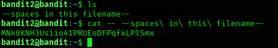

## Level 2 – Opening a File with Spaces in Its Name

### 🧩 Challenge
Find and read a file whose name contains spaces in order to retrieve the password for the next Bandit level.

---

### 🔐 Access Details
Login name: bandit2  
Login password: Obtained from previous level  

---

### 🗂 What Was Available
A file was found with spaces in its name, which cannot be accessed directly unless the spaces are handled properly.

---

### ⚙️ Steps Performed
- ls  
- cat --spaces\ in\ this\ filename--  

---

### 📸 Proof of Work

---

### 🏁 Result
Password for the next level:  
MNk8KNH3USiio4IPRUEoDFPqfxLPlSmx

---

### 🧠 Why This Worked
Linux treats spaces as separators between command arguments.  
By escaping the spaces with backslashes, the full filename is passed correctly to the command.

---

### 🛡️ Skill Gained
Learning how to handle f
