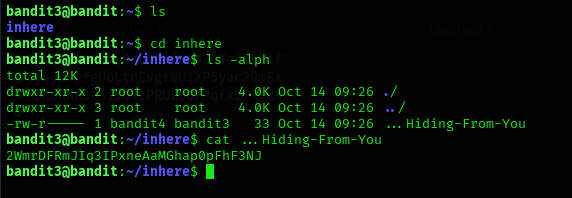

## Level 3 – Finding a Hidden File Inside a Directory

### 🧩 Challenge
Search inside a directory to locate a hidden file that contains the password for the next Bandit level.

---

### 🔐 Access Details
Login name: bandit3  
Login password: Obtained from previous level  

---

### 🗂 What Was Available
Inside the `inhere` directory, normal files were not visible. A hidden file was present and had to be listed explicitly.

---

### ⚙️ Steps Performed
- ls  
- cd inhere  
- ls -alph  
- cat ...Hiding-From-You  

---

### 📸 Proof of Work

---

### 🏁 Result
Password for the next level:  
2WmrDFRmJIq3IPxneAAMaGHqpH3aJf3NJ

---

### 🧠 Why This Worked
Hidden files in Linux start with a dot and are not shown with a normal `ls` command.  
The `-a` option reveals all files, allowing the hidden file to be found and read.

---

### 🛡️ Skill Gained
Learning how to list and access hidden files inside Linux directories.
