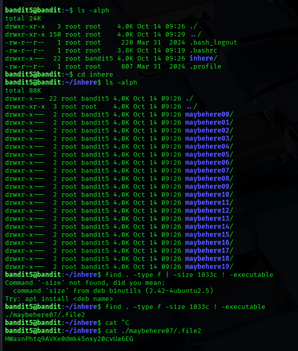

## Level 5 – Searching for a File by Size

### 🧩 Challenge
Find a file inside multiple directories that matches a specific size and is not executable in order to retrieve the next password.

---

### 🔐 Access Details
Login name: bandit5  
Login password: Obtained from previous level  

---

### 🗂 What Was Available
The `inhere` directory contained many subdirectories named `maybehereXX`, each containing files. Only one file matched the required size and permissions.

---

### ⚙️ Steps Performed
- ls  
- cd inhere  
- ls -alph  
- find . -type f -size 1033c ! -executable  
- cat ./maybehere07/.file2  

---

### 📸 Proof of Work

---

### 🏁 Result
Password for the next level:  
HWansPhtq9AVKe0dmk45nxy20cvUa6EG

---

### 🧠 Why This Worked
The `find` command searches through all directories and filters files based on size and executable permission.  
By matching the required file properties, the correct file was located and read.

---

### 🛡️ Skill Gained
Using advanced file search techniques to locate files based on attributes such as size and permissions.
