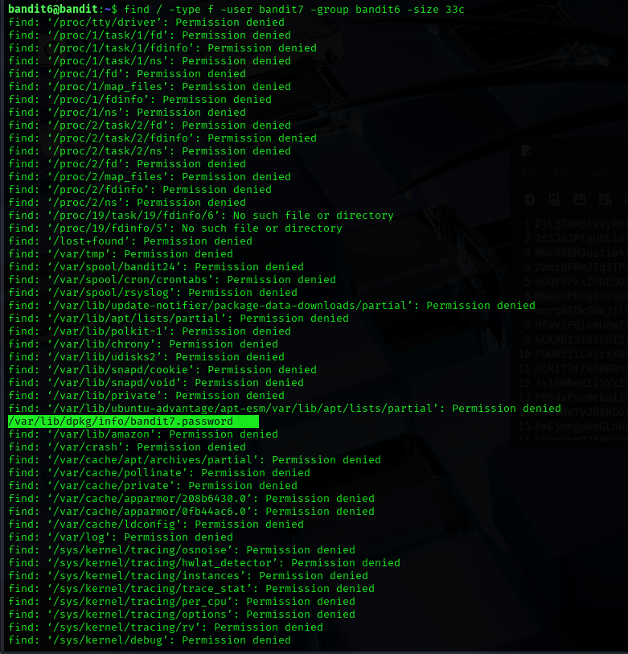

## Level 6 – Locating a File by Owner and Size

### 🧩 Challenge
Search the entire system for a file that belongs to a specific user and group and has a fixed size in order to retrieve the next password.

---

### 🔐 Access Details
Login name: bandit6  
Login password: Obtained from previous level  

---

### 🗂 What Was Available
The password file was not located in the home directory. It was hidden somewhere in the system with specific ownership and size attributes.

---

### ⚙️ Steps Performed
- find / -type f -user bandit7 -group bandit6 -size 33c  
- cat /var/lib/dpkg/info/bandit7.password  

---

### 📸 Proof of Work

---

### 🏁 Result
Password for the next level:  
morbNTDkSW6jIlUc0ymOdMaLnOlFVAaj

---

### 🧠 Why This Worked
The `find` command allows filtering files based on ownership, group, and size.  
By applying all three filters, the exact password file was located and read.

---

### 🛡️ Skill Gained
Using advanced search filters in Linux to locate sensitive files based on fil

