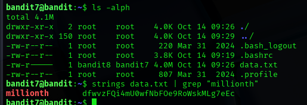

## Level 7 – Extracting a Word from a Large File

### 🧩 Challenge
Locate a hidden password inside a large text file by searching for a specific keyword.

---

### 🔐 Access Details
Login name: bandit7  
Login password: Obtained from previous level  

---

### 🗂 What Was Available
A file named `data.txt` contained many strings.  
The password was located near the word **"millionth"** inside this file.

---

### ⚙️ Steps Performed
- ls -alph  
- strings data.txt | grep millionth  

---

### 📸 Proof of Work

---

### 🏁 Result
Password for the next level:  
dfwvzFQi4mu0wfNbFOe9R0WsKMlg7eEc

---

### 🧠 Why This Worked
The `strings` command extracts readable text from a binary or mixed file.  
The `grep` command filters lines containing the specified word, revealing the password.

---

### 🛡️ Skill Gained
Learning how to search large files and extract specific information using text-processing tools.
