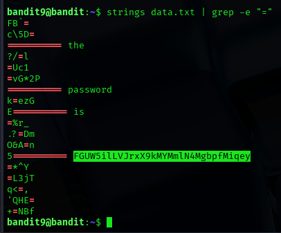

## Level 9 – Extracting the Password Using Symbols

### 🧩 Challenge
Search inside a data file to locate a password hidden between specific symbols.

---

### 🔐 Access Details
Login name: bandit9  
Login password: Obtained from previous level  

---

### 🗂 What Was Available
The file `data.txt` contained many readable strings mixed with symbols.  
The password was hidden between `=` characters.

---

### ⚙️ Steps Performed
- strings data.txt | grep -e "="  

---

### 📸 Proof of Work

---

### 🏁 Result
Password for the next level:  
FGUW5ilLvJrxX9kMYmtLN4MgbpFmiqey

---

### 🧠 Why This Worked
The `strings` command extracts readable text from a file.  
The `grep` command filters lines containing the `=` character, revealing the hidden password.

---

### 🛡️ Skill Gained
Learning how to search for patterns inside large data files using text-processing commands.
