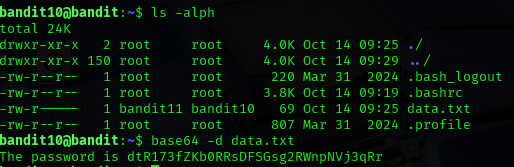

## Level 10 – Decoding Base64 Data

### 🧩 Challenge
Decode a Base64-encoded file to reveal the password for the next Bandit level.

---

### 🔐 Access Details
Login name: bandit10  
Login password: Obtained from previous level  

---

### 🗂 What Was Available
A file named `data.txt` was found to contain Base64-encoded data rather than plain text.

---

### ⚙️ Steps Performed
- ls -alph  
- base64 -d data.txt  

---

### 📸 Proof of Work

---

### 🏁 Result
Password for the next level:  
dTR7r3f7Kb0RRsDFSGsg2RwnpNVj3qRr

---

### 🧠 Why This Worked
The `base64 -d` command decodes Base64-encoded content back into readable text, revealing the hidden password.

---

### 🛡️ Skill Gained
Understanding how encoded data can be c
