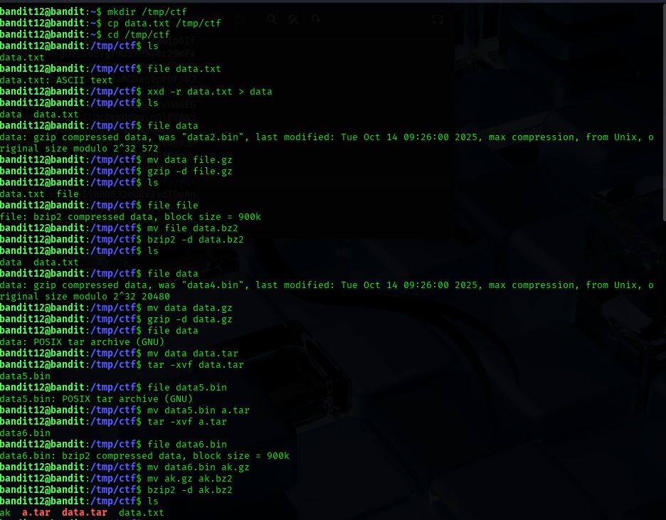

## Level 12 – Unpacking a Multi-Layered File

### 🧩 Challenge
Recover a password hidden inside a file that has been encoded and compressed multiple times using different formats.

---

### 🔐 Access Details
Login name: bandit12  
Login password: Obtained from previous level  

---

### 🗂 What Was Available
The file `data.txt` contained data that was not readable directly.  
It was encoded and archived several times using different compression methods.

---

### ⚙️ Steps Performed
- mkdir /tmp/ctf  
- cp data.txt /tmp/ctf  
- cd /tmp/ctf  
- xxd -r data.txt > data  
- file data  
- mv data data.gz  
- gzip -d data.gz  
- file data  
- mv data data.bz2  
- bzip2 -d data.bz2  
- file data  
- mv data data.tar  
- tar -xvf data.tar  
- file data5.bin  
- mv data5.bin ak.tar  
- tar -xvf ak.tar  
- file data8.bin  
- mv data8.bin ak.gz  
- gzip -d ak.gz  
- file ak  
- cat ak  

---

### 📸 Proof of Work

**Hex decoding and multiple extraction steps**

-

**Final decoded file showing the password**

---

### 🏁 Result
Password for the next level:  
FO5dwFsc0cbaIiH0h8J2eUks2vdTDwAn

---

### 🧠 Why This Worked
Each time the file was extracted, its real format was detected using the `file` command.  
By repeatedly decoding and unpacking the file based on its format, the original readable text containing the password was recovered.

---

### 🛡️ Skill Gained
Understanding how to analyze unknown files and peel off multiple layers of encoding and compression using Linux tools.
