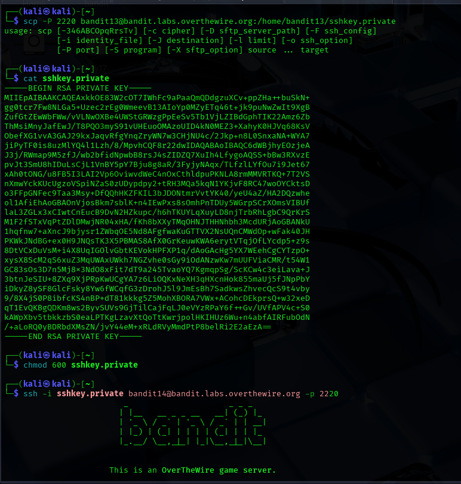
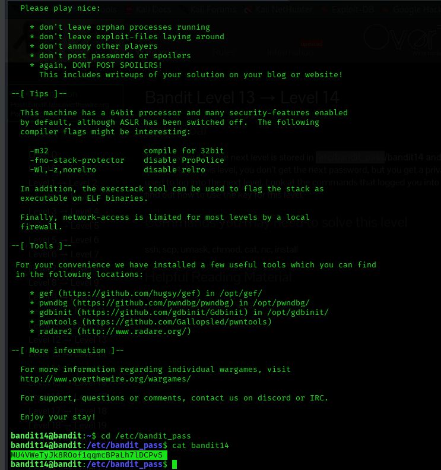

## Level 13 – Logging in Using an SSH Private Key

### 🧩 Challenge
Use a provided private SSH key to authenticate as the next user and gain access to the following level.

---

### 🔐 Access Details
Login name: bandit13  
Login password: Obtained from previous level  

---

### 🗂 What Was Available
Inside the home directory of `bandit13`, a file named `sshkey.private` was present.  
This file contained an SSH private key that allows logging in as the next user without using a password.

---

### ⚙️ Steps Performed
- cd /etc/bandit_pass  
- cat bandit14  
- scp -P 2220 bandit13@bandit.labs.overthewire.org:/home/bandit13/sshkey.private .  
- cat sshkey.private  
- chmod 600 sshkey.private  
- ssh -i sshkey.private bandit14@bandit.labs.overthewire.org -p 2220  

---

### 📸 Proof of Work

**Viewing the next level password and locating the SSH key**  

-

**Using the private key to authenticate and log in**  

---

### 🏁 Result
Password for the next level:  
MUIrws5K8KTRyN2F9bq7eW9g6A0A7t0s

---

### 🧠 Why This Worked
SSH supports key-based authentication.  
By setting correct permissions on the private key and using the `-i` option, the SSH client authenticated as `bandit14` without requiring a password.

---

### 🛡️ Skill Gained
Understanding how to use SSH private keys for secure, password-less authentication between systems.

