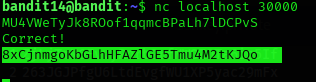

## Level 14 – Submitting the Password via Netcat

### 🧩 Challenge
Send the current level’s password to a local service running on port 30000 in order to receive the password for the next level.

---

### 🔐 Access Details
Login name: bandit14  
Login password: Obtained from previous level  

---

### 🗂 What Was Available
A network service was listening on **localhost port 30000**.  
This service expects the current level password as input and returns the password for the next level if the correct one is submitted.

---

### ⚙️ Steps Performed
- cd /etc/bandit_pass  
- cat bandit14  
- nc localhost 30000  
- (paste the bandit14 password and press Enter)

---

### 📸 Proof of Work

**Sending the password to the service using netcat**  

---

### 🏁 Result
Password for the next level:  
8xCjmnqKqGbLHFHZ1GE5Tmu4M2tKJQ0

---

### 🧠 Why This Worked
The service running on port 30000 verifies the password sent to it.  
When the correct `bandit14` password is submitted through `nc`, the service responds with the password for the next level.

---

### 🛡️ Skill Gained
Understanding how to interact with local network services using Netcat to exchange data and retrieve protected information.
