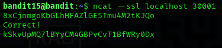

## Level 15 – Secure Communication with SSL

### 🧩 Challenge
Connect to a local SSL-enabled service and submit the current password to retrieve the password for the next level.

---

### 🔐 Access Details
Login name: bandit15  
Login password: Obtained from previous level  

---

### 🗂 What Was Available
A secure service was running on **localhost port 30001**.  
This service requires an **SSL-encrypted connection** and expects the current level password as input.

---

### ⚙️ Steps Performed
- cd /etc/bandit_pass  
- cat bandit15  
- ncat --ssl localhost 30001  
- (paste the bandit15 password and press Enter)

---

### 📸 Proof of Work

**Sending the password over an SSL connection**  

---

### 🏁 Result
Password for the next level:  
kSkvUpMQ7LByvCM4GBPvCvT1BfWry0Dx

---

### 🧠 Why This Worked
The service on port 30001 accepts only encrypted SSL connections.  
Using `ncat --ssl` establishes a secure channel, allowing the correct password to be sent and verified.

---

### 🛡️ Skill Gained
Learning how to interact with SSL-protected network services using Netcat for secure data exchange.
