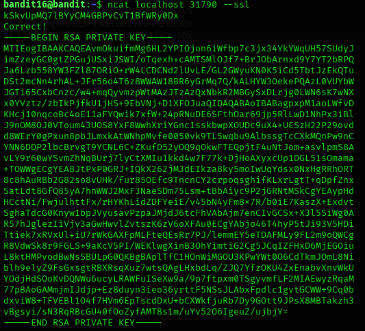
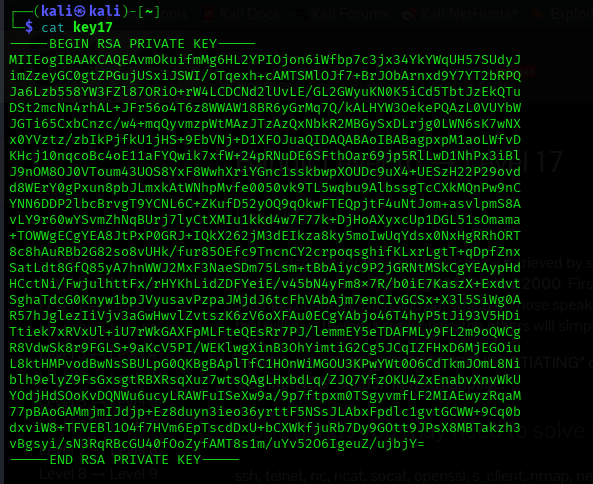
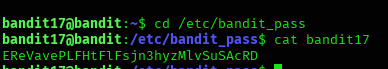

## Level 16 – Extracting a Private Key via SSL Service

### 🧩 Challenge
Connect to a secure service, submit the current password, and retrieve a private SSH key that allows access to the next level.

---

### 🔐 Access Details
Login name: bandit16  
Login password: Obtained from previous level  

---

### 🗂 What Was Available
A secure SSL-enabled service was running on **localhost port 31790**.  
When the correct password is sent, the service returns an **RSA private key** instead of a plain text password.

---

### ⚙️ Steps Performed
- cd /etc/bandit_pass  
- cat bandit17  
- ncat --ssl localhost 31790  
- (paste the bandit16 password and press Enter)  
- (copy the returned RSA private key)

---

### 📸 Proof of Work

**Retrieving the password for verification**  

-

**Receiving the RSA private key from the SSL service**  

-

**Full extracted private key**  

---

### 🏁 Result
RSA private key obtained for the next level (used to log in as `bandit17`).

---

### 🧠 Why This Worked
The service on port 31790 verifies the submitted password and returns a private key instead of a text password.  
This key can be saved and used for SSH authentication to access the next level.

---

### 🛡️ Skill Gained
Learning how to retrieve and handle SSH private keys securely through encrypted network services.
