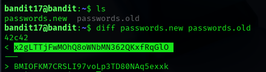

## Level 17 – Finding the Unique Password Using Diff

### 🧩 Challenge
Compare two password files and identify the line that exists only in one file to find the password for the next level.

---

### 🔐 Access Details
Login name: bandit17  
Login password: Obtained from previous level  

---

### 🗂 What Was Available
Two files were present in the home directory:  
- `passwords.new`  
- `passwords.old`  

Both contained many lines of text, but only one line was different between them.  
That unique line represented the password for the next level.

---

### ⚙️ Steps Performed
- ls  
- diff passwords.new passwords.old  

---

### 📸 Proof of Work

**Comparing the two password files to find the unique line**  

---

### 🏁 Result
Password for the next level:  
x2gLTTjFwmOhQ8oWNbMN362QKxfRqG10

---

### 🧠 Why This Worked
The `diff` command compares two files line by line.  
It highlights lines that are different, allowing the single unique password to be easily identified.

---

### 🛡️ Skill Gained
Using file comparison tools to locate changes and extract meaningful differences between datasets.
