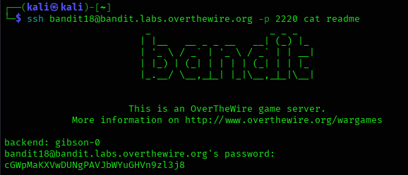

## Level 18 – Command Execution Without Interactive Shell

### 🧩 Challenge
The shell for this level logs out immediately after login.  
Execute a command directly over SSH to retrieve the password for the next level.

---

### 🔐 Access Details
Login name: bandit18  
Login password: Obtained from previous level  

---

### 🗂 What Was Available
Normal SSH login closes the session instantly.  
However, SSH allows executing a command remotely without opening an interactive shell.

---

### ⚙️ Steps Performed
- ssh bandit18@bandit.labs.overthewire.org -p 2220 cat readme  

---

### 📸 Proof of Work

**Running a remote command via SSH to read the password file**  

---

### 🏁 Result
Password for the next level:  
cGWpMaKXWvDUNgPAVJbWYUGhVn9zLj38

---

### 🧠 Why This Worked
Although interactive login is blocked, SSH still allows executing commands directly.  
By passing `cat readme` as a remote command, the password was displayed before the connection closed.

---

### 🛡️ Skill Gained
Learning how to execute remote commands over SSH even when interactive shell access is restricted.
