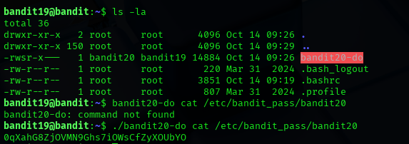

## Level 19 – Using a SetUID Binary to Access Another User

### 🧩 Challenge
Use a special SetUID program to execute commands as another user and retrieve the password for the next level.

---

### 🔐 Access Details
Login name: bandit19  
Login password: Obtained from previous level  

---

### 🗂 What Was Available
A binary named `bandit20-do` was present in the home directory.  
This file had the **SetUID** permission, meaning it could run commands as the `bandit20` user.

---

### ⚙️ Steps Performed
- ls -la  
- ./bandit20-do cat /etc/bandit_pass/bandit20  

---

### 📸 Proof of Work

**Using the SetUID binary to read another user’s password**  

---

### 🏁 Result
Password for the next level:  
0qXahG8ZjoVNM9Ghs7iOWsCfZyXOUbY0

---

### 🧠 Why This Worked
The `bandit20-do` binary runs with the privileges of `bandit20`.  
By passing a command to it, the file `/etc/bandit_pass/bandit20` was read using higher privileges.

---

### 🛡️ Skill Gained
Understanding how SetUID binaries can be leveraged to execute commands as anothe
