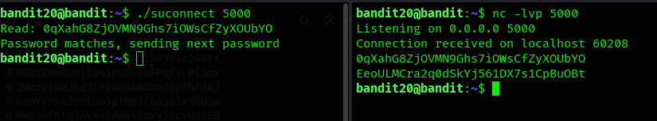

## Level 20 – Interacting with a Network Service via suconnect

### 🧩 Challenge
Use a special binary to send the current password to a listening service and receive the password for the next level.

---

### 🔐 Access Details
Login name: bandit20  
Login password: Obtained from previous level  

---

### 🗂 What Was Available
A binary named `suconnect` was available.  
It connects to a given port, sends the current password, and waits for the service to respond with the next password.

---

### ⚙️ Steps Performed
- nc -lvp 5000  
- (open another terminal)  
- ./suconnect 5000  

---

### 📸 Proof of Work

**Listening for the password and using suconnect to send it**  

---

### 🏁 Result
Password for the next level:  
EeolLmcra2qdSkYj561DX7s1CpBuOBt

---

### 🧠 Why This Worked
The `suconnect` program sends the current password to the specified port.  
The listening `nc` service receives it, verifies it, and replies with the password for the next level.

---

### 🛡️ Skill Gained
Understanding how local network services and custom client programs can be used to exchange authentication data.
