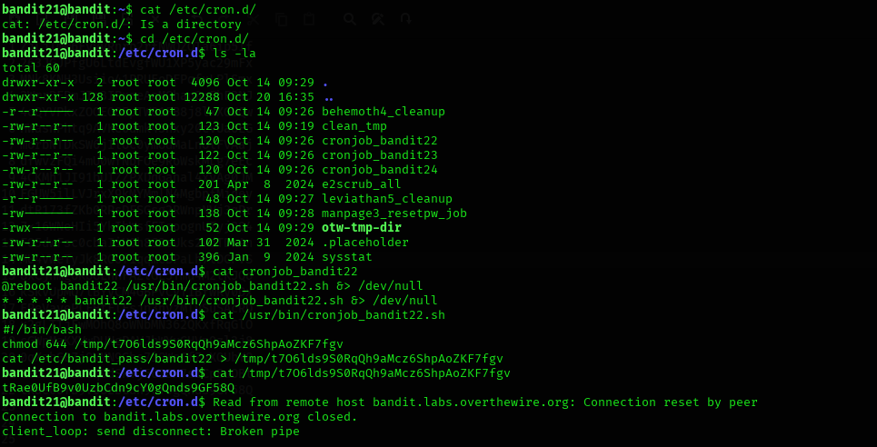

## Level 21 – Extracting a Password from a Cron Job

### 🧩 Challenge
Identify a scheduled cron job that runs as another user and use it to obtain the password for the next level.

---

### 🔐 Access Details
Login name: bandit21  
Login password: Obtained from previous level  

---

### 🗂 What Was Available
Inside `/etc/cron.d/`, several cron jobs were present.  
One of them, `cronjob_bandit22`, executed a script that copied the password for `bandit22` into a temporary file.

---

### ⚙️ Steps Performed
- cd /etc/cron.d  
- ls -la  
- cat cronjob_bandit22  
- cat /usr/bin/cronjob_bandit22.sh  
- cat /tmp/t706lds9S0RQgh9aMcz6ShpAoZKF7fgv  

---

### 📸 Proof of Work

**Reading the cron job and extracting the generated password file**  

---

### 🏁 Result
Password for the
