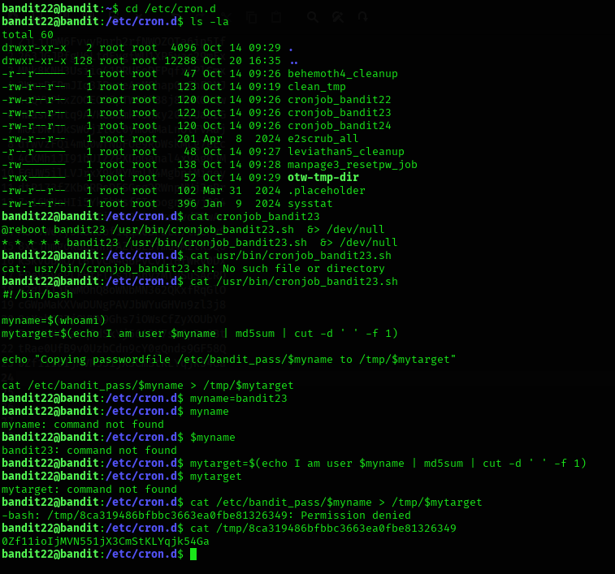

## Level 22 – Understanding a Cron Job Script to Locate the Password

### 🧩 Challenge
Analyze a cron job script to determine where it stores the next level’s password.

---

### 🔐 Access Details
Login name: bandit22  
Login password: Obtained from previous level  

---

### 🗂 What Was Available
A cron job named `cronjob_bandit23` was running periodically.  
It executed a script that dynamically generated a filename using the username and stored the password for `bandit23` in that file.

---

### ⚙️ Steps Performed
- cd /etc/cron.d  
- ls -la  
- cat cronjob_bandit23  
- cat /usr/bin/cronjob_bandit23.sh  
- myname=bandit23  
- mytarget=$(echo I am user $myname | md5sum | cut -d ' ' -f 1)  
- cat /tmp/$mytarget  

---

### 📸 Proof of Work

**Analyzing the cron job and reading the generated password file**  

---

### 🏁 Result
Password for the next level:  
0zfLhioLJMVn551Yx3CmStkLygjk54Ga

---

### 🧠 Why This Worked
The script hashes the string `I am user bandit23` to create a filename in `/tmp`.  
By recreating the same hash, the correct file containing the password can be located and read.

---

### 🛡️ Skill Gained
Learning how to reverse-engineer automated scripts to find dynamically generated files and extract sensitive data.
