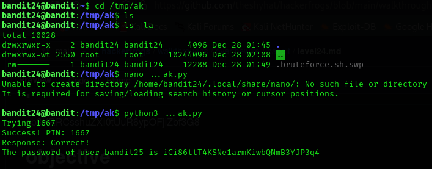
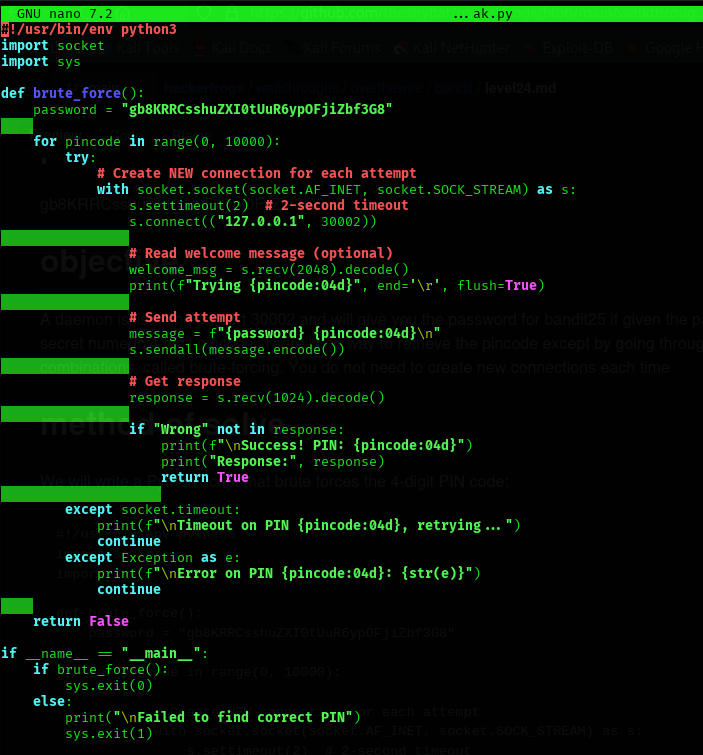

## Level 24 – Brute-Forcing a PIN Protected Network Service

### 🧩 Challenge
A service running on localhost requires the correct password and a 4-digit PIN.  
The goal is to brute-force the PIN and obtain the password for the next level.

---

### 🔐 Access Details
Login name: bandit24  
Login password: Obtained from previous level  

---

### 🗂 What Was Available
A network service was listening on **localhost port 30002**.  
It required two inputs:
1. The current level password  
2. A 4-digit PIN  

If both were correct, it would return the password for `bandit25`.

---

### ⚙️ Steps Performed
- cd /tmp/ak  
- nano ...ak.py  
- (write a Python brute-force script to try all PINs from 0000 to 9999)  
- python3 ...ak.py  

---

### 📸 Proof of Work

**Python brute-force script used to try all PINs**  

-

**Successful PIN discovery and password retrieval**  

---

### 🏁 Result
Password for the next level:  
iCi86ttT4KSNe1armKiwbQNmB3YJP3q4

---

### 🧠 Why This Worked
The service accepted
