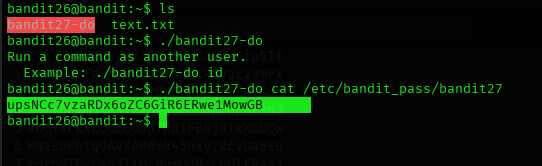

## Level 26 – Escaping a Restricted Pager to Gain a Shell

### 🧩 Challenge
The login for `bandit26` opens inside a restricted pager instead of a normal shell.  
Escape this environment, gain a shell, and retrieve the password for the next level.

---

### 🔐 Access Details
Login name: bandit26  
Login password: Obtained from previous level (via SSH key)  

---

### 🗂 What Was Available
After logging in using the SSH key, the session opened inside a **pager** (`more`-like restricted view).  
The pager allowed entering a shell command using `:shell`.

A SetUID binary `bandit27-do` was also available, which could execute commands as `bandit27`.

---

### ⚙️ Steps Performed
- ssh -i bandit26.sshkey bandit26@bandit.labs.overthewire.org -p 2220  
- (inside pager) :shell  
- ./bandit27-do cat /etc/bandit_pass/bandit27  

---

### 📸 Proof of Work

**Escaping the pager and accessing the shell**  

-

**Using the SetUID binary to read bandit27 password**  

---

### 🏁 Result
Password for the next level:  
upsNCc7vzaRXdX60zC6GiR6ERWe1MoWG

---

### 🧠 Why This Worked
The restricted pager allowed spawning a shell using `:shell`.  
From there, the SetUID program `bandit27-do` was used to run commands as `bandit27`, allowing access to its password file.

---

### 🛡️ Skill Gained
Learning how to escape restricted environments and leverage SetUID binaries to elevate privileges.
