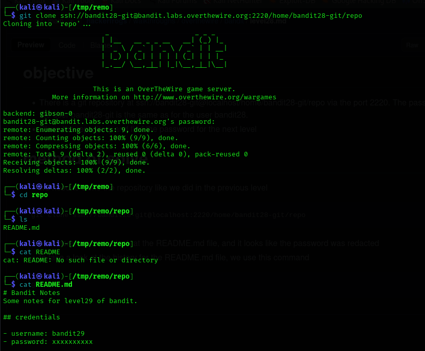
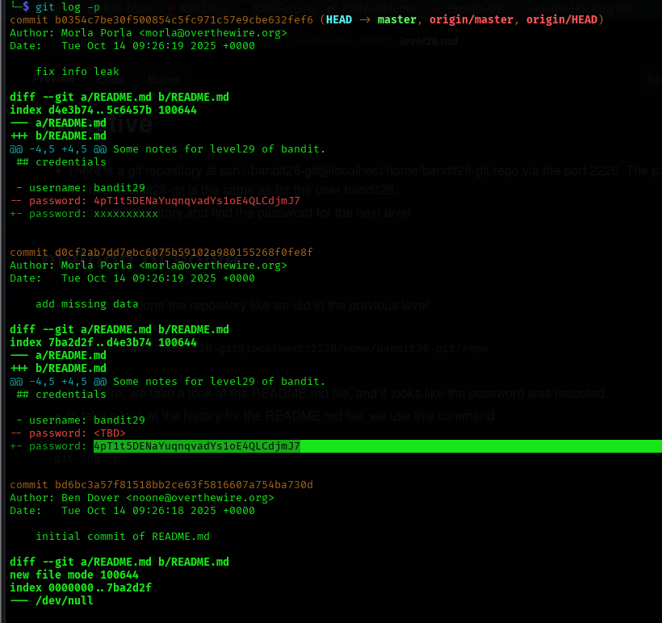

## Level 28 – Recovering a Deleted Password from Git History

### 🧩 Challenge
The password for the next level was removed from the README file.  
Use Git history to recover the previously stored credentials.

---

### 🔐 Access Details
Login name: bandit28  
Login password: Obtained from previous level  

---

### 🗂 What Was Available
A Git repository contained a `README.md` file where the password was replaced with `xxxxxxxx`.  
However, Git keeps full commit history, allowing older versions of files to be inspected.

---

### ⚙️ Steps Performed
- git clone ssh://bandit28-git@bandit.labs.overthewire.org:2220/home/bandit28-git/repo  
- cd repo  
- cat README.md  
- git log -p  

---

### 📸 Proof of Work

**Viewing Git commit history and spotting the removed password**  

-

**Cloning and inspecting the repository**  

---

### 🏁 Result
Password for the next level:  
4pT1t5DENaYuqnqvadYs1oE4QLCdjmJ7

---

### 🧠 Why This Worked
Although the password was removed from the latest version, Git preserved it in a previous commit.  
By reviewing the diff history, the original password could be recovered.

---

### 🛡️ Skill Gained
Learning how to use Git history and diffs to recover deleted or modified sensitive data.
