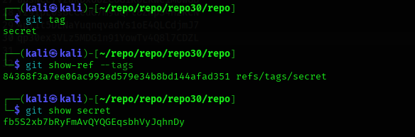

## Level 30 – Extracting a Password from a Git Tag

### 🧩 Challenge
The password is not in the commit history or branches.  
It is hidden inside a Git tag.

---

### 🔐 Access Details
Login name: bandit30  
Login password: Obtained from previous level  

---

### 🗂 What Was Available
The Git repository contained a tag named `secret`.  
Tags in Git can store extra data, including messages and objects that are not visible in normal file history.

---

### ⚙️ Steps Performed
- git clone ssh://bandit30-git@bandit.labs.overthewire.org:2220/home/bandit30-git/repo  
- cd repo  
- git tag  
- git show-ref --tags  
- git show secret  

---

### 📸 Proof of Work

**Listing and inspecting the secret Git tag**  

-

**Password revealed inside the tag**  

---

### 🏁 Result
Password for the next level:  
fb55zxb7bRyFmAvQYQEGqsbHvVjqhnDy

---

### 🧠 Why This Worked
Git tags can store annotated messages and data.  
By displaying the `secret` tag, the hidden password was revealed even though it was not in any branch or file.

---

### 🛡️ Skill Gained
Understanding how Git tags can be used to hide or store sensitive information and how to inspect them.
