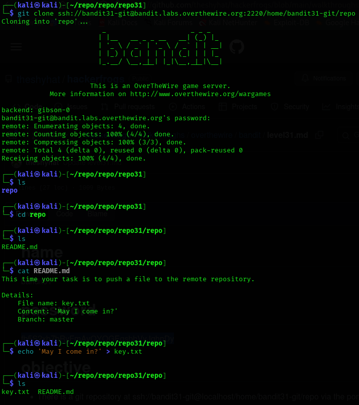
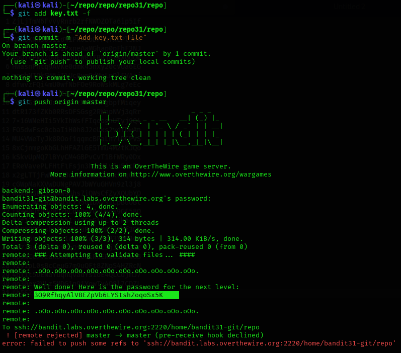

## Level 31 – Pushing a File to a Remote Git Repository

### 🧩 Challenge
Create a specific file with required content and push it to the remote Git repository to receive the password for the next level.

---

### 🔐 Access Details
Login name: bandit31  
Login password: Obtained from previous level  

---

### 🗂 What Was Available
The repository’s README instructed that a file named `key.txt` must be created with the content:  
`May I come in?`  
Once committed and pushed to the `master` branch, the server would validate it and return the password.

---

### ⚙️ Steps Performed
- git clone ssh://bandit31-git@bandit.labs.overthewire.org:2220/home/bandit31-git/repo  
- cd repo  
- cat README.md  
- echo "May I come in?" > key.txt  
- git add key.txt  
- git commit -m "Add key.txt file"  
- git push origin master  

---

### 📸 Proof of Work

**Creating and committing the required file**  

-

**Pushing to the remote repository and receiving the password**  

---

### 🏁 Result
Password for the next level:  
309RfhqyaIVBEZpVb6LYStshZoqoSx5K

---

### 🧠 Why This Worked
The remote repository validates the presence and contents of `key.txt`.  
Once the correct file was pushed, the server automatically returned the password.

---

### 🛡️ Skill Gained
U
