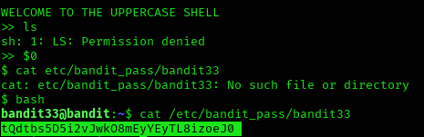

## Level 32 – Escaping the Uppercase Shell

### 🧩 Challenge
The login shell automatically converts all commands to uppercase, making normal commands unusable.  
Find a way to escape this shell and read the password for the next level.

---

### 🔐 Access Details
Login name: bandit32  
Login password: Obtained from previous level  

---

### 🗂 What Was Available
The shell forces all typed commands into uppercase.  
This breaks normal Linux commands like `ls`, `cat`, and `cd`.

However, special shell variables such as `$0` can be used to spawn a new shell.

---

### ⚙️ Steps Performed
- $0  
- bash  
- cat /etc/bandit_pass/bandit33  

---

### 📸 Proof of Work

**Escaping the uppercase shell and reading the password**  

---

### 🏁 Result
Password for the next level:  
tQdtbs5D5j2vJwk08mEyYEyTL8izoeJO

---

### 🧠 Why This Worked
`$0` runs the current shell binary directly, bypassing the uppercase transformation.  
This opens a normal shell where standard Linux commands work again.

---

### 🛡️ Skill Gained
Understanding how restricted shells can be bypassed using environment variables and shell behavior.
