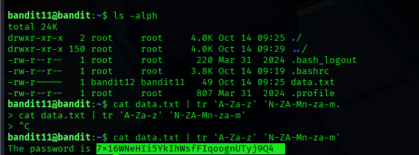

## Level 11 – Breaking a ROT13 Cipher

### 🧩 Challenge
Decrypt a file that has been encoded using the ROT13 cipher in order to retrieve the password.

---

### 🔐 Access Details
Login name: bandit11  
Login password: Obtained from previous level  

---

### 🗂 What Was Available
The file `data.txt` contained text that looked scrambled but followed a predictable substitution pattern.

---

### ⚙️ Steps Performed
- ls -alph  
- cat data.txt | tr 'A-Za-z' 'N-ZA-Mn-za-m'  

---

### 📸 Proof of Work

---

### 🏁 Result
Password for the next level:  
7x16WNeHTsFj9Qgx6N7iD0Bxr0vdZSqE

---

### 🧠 Why This Worked
ROT13 replaces each letter with another 13 positions away in the alphabet.  
The `tr` command maps each character back to its original form.

---

### 🛡️ Skill Gained
Understanding and reversing simple substitution ciphers using Linux command-line tools.
